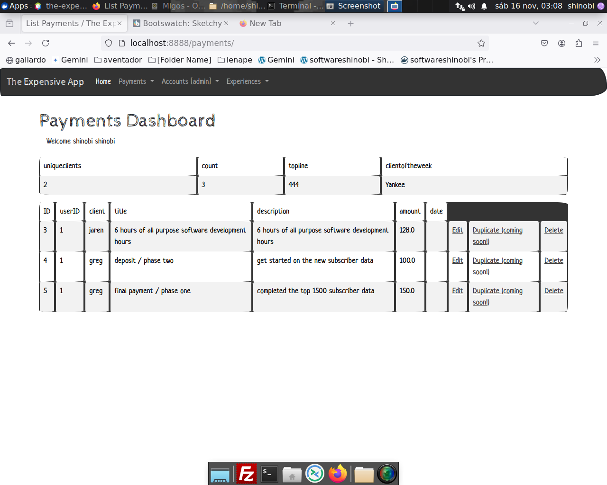

# the expensive app

lorem ipsum.

lorem ipsum sed.

## to the money

[--] app is up

[--] future jaren payment uploaded

[--] future jaren payment calculating correctly

[--] future payment flag in colored display

##

[--] future jaren payment displayed in invoices section

[--] future payments to jaren and jacques and greg and the jacques bootcamp in dashboard

[--] future payments to shinobi academy membership in dashboard

[--] app links to my website and to my github and linkedin

[--] app hides the non working stuff

[--] app scrubbed for github

[--] app pushed to github

[--] app pushed to dockerhub from jenkins

##

[--] cover png update on readme

[--] ui changed to payments

[--] backend updates to payments

[--] lombok used on the models to save future time

## the before times ##

alright. so first we are getting the app up

then we are going make sure all user operations work

then we are going to polish the user endpoints

## the before times ####

the target is the following:

a landing page

bootswatch complete compatability

error handling

self populating sql on load

dockerizatoin all the way to github

## enhancements

put two copies of the kompose documention here (docs.) and (links.)

## bugs

on login, the url is not changed. but the page is. 

after you've registered, the redirect to the login page does not include the recently created values.

if you try to login with a user that doesnt exist u get a 500 error, b/c of null pointer with user error

a user can create a user with an email address collission. there aren't indexes on the table.

the logout and timeout functionalities need to be in their own function. for code reuse.
